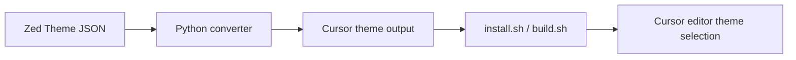

# Cursor Themes

Cyberpunk and Magic: The Gathering theme collections for **Cursor**, converted from [Zed](https://zed.dev) theme JSON.


## ANZSCO 261211 + 261312 Skills Snapshot
- Application theming, visual customization, and style-pack delivery for editor UX (261211).
- Developer tooling automation using Python and shell scripting (261312).
- Build/packaging workflow design for repeatable extension distribution (261312).

## Categories

| Category | Themes | Zed source |
|----------|--------|------------|
| **cyberpunk** | 30 movie-inspired dark/light themes | [cyberpunk-zed-themes](https://github.com/jen-the-dev/cyberpunk-zed-themes) |
| **mtg** | 25 Magic color identity, guild, and shard themes | [zed-mtg-themes](https://github.com/jen-the-dev/zed-mtg-themes) |

Theme names in Cursor appear as `Cyberpunk - Blade Runner`, `Mtg - ...`, etc.

## Quick install

```bash
git clone https://github.com/jen-the-dev/cursor-themes.git
cd cursor-themes
./install.sh
```

Reload Cursor, then **Cmd+K Cmd+T** (or **Preferences: Color Theme**) and pick a theme.

## Rebuild from Zed sources

Cyberpunk Zed themes are symlinked from `../zed-themes/cyberpunk-zed-themes/themes/`.

```bash
python3 scripts/zed_to_cursor.py   # regenerate themes/ + package.json
./install.sh                         # reinstall extension symlink
```

To add MTG themes, drop JSON files into `sources/zed/mtg/` and rerun the converter.

## VSIX package (optional)

```bash
npm install -g @vscode/vsce
./build.sh
```

Install the generated `.vsix` via **Extensions ? Install from VSIX�**

## Uninstall

```bash
./install.sh --uninstall
```

## Layout

```
cursor-themes/
??? sources/zed/
?   ??? cyberpunk/     # symlinks to Zed source JSON
?   ??? mtg/           # drop MTG Zed JSON here
??? themes/
?   ??? cyberpunk/     # converted Cursor themes
?   ??? mtg/
?   ??? manifest.json
??? scripts/zed_to_cursor.py
??? install.sh
??? package.json
```

## License

MIT � see [LICENSE](LICENSE).


## Problem
Teams using visual coding themes need reproducible theme generation and installation workflows across environments.

## Solution
A conversion and packaging workflow for theme collections, including install/rebuild scripts and distribution support.

## Architecture Diagram


## Tech Stack
- Python scripting
- Shell automation
- JSON theme manifests
- VS Code extension packaging

## Setup Instructions
```bash
git clone https://github.com/jen-the-dev/cursor-themes.git
cd cursor-themes
./install.sh
```

## Testing
- python3 scripts/zed_to_cursor.py
- Manual validation by loading generated themes in Cursor

## ANZSCO 261211 + 261312 Competency Evidence
- **261211 (Multimedia Specialist)**: cross-editor theme customization and visual presentation consistency.
- **261312 (Developer Programmer)**: automation scripting, tooling integration, and repeatable configuration management.
- Documentation for maintainable setup and distribution processes.

## Commit Convention
Use Conventional Commits for presentation clarity:
- `feat(scope): add new user-facing capability`
- `fix(scope): resolve functional defect`
- `test(scope): add or improve automated tests`
- `docs(readme): improve project documentation`

## Evidence Map
- `scripts/zed_to_cursor.py`
- `themes/`
- `install.sh`
